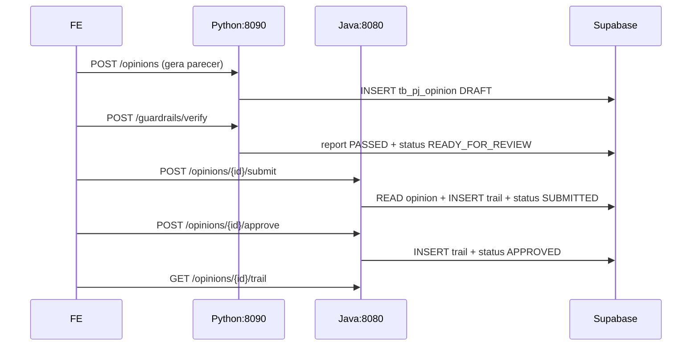

# Handoff Emilly → Noah — EP-03 F04 HITL / Contrato Java ↔ Python

| Campo | Valor |
|-------|-------|
| **De** | Emilly (`dev-python-esp`) — Copiloto GenAI PJ |
| **Para** | Noah (`dev-java-esp`) — BC `pj` HITL/alçada |
| **Data** | 2026-07-28 |
| **Épico** | `PRISMA-EP-03` Copiloto GenAI PJ |
| **US dona (Noah)** | `PRISMA-EP-03-F04-US-BE-01` Controle de Alçada e Trilha |
| **Python repo** | `Prisma/backend-python` · porta **8090** |
| **Java repo** | `Prisma/backend` · porta **8080** |
| **DB** | **mesmo Supabase** `jrpjrvttiqustpfedxdz` (já compartilhado) |

**Objetivo deste handoff:** fechar o contrato para Noah implementar F04 (submit / approve / trail) **sem** tocar Bedrock/Ollama, e integrar com o parecer que o Python já gera.

---

## 1. Divisão de ownership (não negociável)

| Responsabilidade | Dono | Onde |
|------------------|------|------|
| Extração / RAG / índices / parecer GenAI / guardrails | **Emilly (Python)** | `backend-python` · `/api/v1/pj/**` (exceto HITL) |
| Alçada, submit, approve/reject, trilha, segregação de funções | **Noah (Java)** | `backend` · BC `pj` |
| OIDC / roles Keycloak | **Noah** | já no Spring |
| Tabelas GenAI `tb_pj_document|rag_*|ratio_*|opinion|guardrail_*` | Emilly (já no Supabase) | schema `public` |
| Tabelas HITL `tb_pj_approval_policy|approval_trail` | **Noah cria (Flyway)** | mesmo Supabase |

```
FE / Analista
    │
    ├─ GenAI (gerar parecer, RAG, ratios) ──► Python :8090
    │
    └─ HITL (submit / approve / trail) ─────► Java :8080
                                              │
                                              └─ port out (opcional) ──► Python
                                                 (ler parecer / patch status)
```

Java **não** embute LLM. Python **não** decide alçada.

---

## 2. O que a Emilly já entregou (lab)

| Item | Status |
|------|--------|
| Serviço FastAPI hexagonal | ✅ `backend-python` |
| Providers `local\|bedrock\|openai\|gemini` | ✅ (sem voz) |
| RAG + pgvector no Supabase | ✅ smoke e2e OK |
| F05 ratios / F03 opinions / F06 guardrails | ✅ P2 |
| F01 extração | ⏭ **PENDENTE** (sem massa documental) |
| Auth JWT nas rotas Python | ✅ Emilly 2026-07-28 — `OIDC_ENABLED` + JWKS (lab off default) |

### Base URL Python (lab)

```
http://localhost:8090
Health: GET /health
Ready:  GET /ready
OpenAPI: http://localhost:8090/docs
```

```bash
cd Prisma/backend-python
uv sync
uv run uvicorn prisma_pj.presentation.main:app --port 8090
```

### Endpoints Python relevantes para F04

| Método | Path | Uso pelo Java |
|--------|------|----------------|
| `GET` | `/api/v1/pj/opinions/{opinionId}` | Ler status/seções antes de submit/approve |
| `PATCH` | `/api/v1/pj/opinions/{opinionId}` | (FE) edição pré-HITL — Java só precisa **bloquear** se status inválido |
| `POST` | `/api/v1/pj/guardrails/verify` | Opcional: Java pode exigir `READY_FOR_REVIEW` / report PASSED antes de submit |
| `GET` | `/api/v1/pj/guardrails/report/{opinionId}` | Auditoria pré-submit |

**Java NÃO precisa chamar:** `/rag/*`, `/ratios/*`, `/library/*` para F04 (FE chama Python direto, ou BFF Java no futuro).

---

## 3. Máquina de estados do parecer (contrato compartilhado)

Status vivem em `tb_pj_opinion.status` (já existe no Supabase).

```
GENERATING → DRAFT | PARTIAL
                ↓
         (F06 verify PASSED)
                ↓
        READY_FOR_REVIEW
                ↓  « Noah: POST submit »
            SUBMITTED
                ↓  « Noah: approve / escalate / reject »
     APPROVED | REJECTED | (volta fila L+)
                ↓
        (emissão / circulação — fora GenAI)
```

| Status | Quem escreve | Significado |
|--------|--------------|-------------|
| `GENERATING` | Python | Job de geração |
| `DRAFT` / `PARTIAL` | Python | Editável (PATCH) |
| `BLOCKED` | Python (F06 FAILED) | Não pode submit |
| `READY_FOR_REVIEW` | Python (F06 PASSED) | Pronto para HITL |
| `SUBMITTED` | **Noah** | Na fila de alçada |
| `APPROVED` | **Noah** | HITL ok |
| `REJECTED` | **Noah** | Reprovado com comment |

### Regras de cruzamento

1. **Submit** só se status ∈ {`READY_FOR_REVIEW`, `DRAFT`} **e** guardrail latest ≠ `FAILED` (recomendado: exigir `READY_FOR_REVIEW`).
2. **PATCH** Python (edição humana) → **409** se status ∈ {`SUBMITTED`, `APPROVED`, `BLOCKED`} (Python já bloqueia `SUBMITTED|APPROVED|BLOCKED`).
3. **Emitir / circular** sem `APPROVED` → **409** (RN002 F04) — regra Noah.
4. Criador ≠ aprovador (RN003) — regra Noah via JWT `sub`.

---

## 4. Contrato HTTP que o Noah implementa (F04)

US: `PRISMA-EP-03-F04-US-BE-01`  
Prefixo sugerido (alinhar FE): **`/api/v1/pj`** no Java **ou** proxy:

> **Decisão sugerida (lab):** Java expõe HITL em `/api/v1/pj/opinions/{id}/submit|approve|reject` e `/trail`.  
> FE chama Java `:8080` para HITL e Python `:8090` para GenAI.  
> Alternativa futura: BFF único no Java que faz port-out para Python.

### 4.1 `POST /api/v1/pj/opinions/{id}/submit`

**Auth:** JWT · `ROLE_ANALISTA_PJ`  
**Pré:** parecer existe; status permitido; ator = criador ou analista da carteira.

**Request**

```json
{
  "comment": "Encaminho para alçada L2"
}
```

**Comportamento**

1. GET Python ` /opinions/{id}` (ou SELECT local em `tb_pj_opinion` — **mesmo DB**).
2. Validar status + (opcional) último guardrail PASSED.
3. Resolver nível pela `operation_amount` × `tb_pj_approval_policy`.
4. INSERT append-only em `tb_pj_approval_trail` (`action=SUBMIT`, `level_code=L2`, …).
5. UPDATE `tb_pj_opinion.status = 'SUBMITTED'` (**mesmo registro** que o Python criou).
6. Notificar fila aprovador (SQS stub ok no lab).

**Response 200**

```json
{
  "opinionId": "34b6c016-7acc-4f94-891b-4320ad8b5e48",
  "status": "SUBMITTED",
  "requiredLevel": "L2",
  "trailId": "…"
}
```

| Erro | Quando |
|------|--------|
| 404 | opinion inexistente |
| 409 | status não permite submit / guardrail FAILED |
| 403 | sem role / fora da carteira |

### 4.2 `POST /api/v1/pj/opinions/{id}/approve`

**Auth:** JWT · `ROLE_APROVADOR_PJ_L1|L2|L3`  
**RN003:** `actor_id ≠ created_by`.

**Request**

```json
{
  "decision": "APPROVE",
  "comment": "De acordo com a régua L2"
}
```

`decision`: `APPROVE` | `REJECT` | `ESCALATE`

**Comportamento**

1. Validar nível do token ≥ nível requerido (ou escalate).
2. Append trail (`APPROVE` / `REJECT` / `ESCALATE`).
3. Se APPROVE e nível suficiente → `status=APPROVED`.
4. Se REJECT → `status=REJECTED` (**comment obrigatório** → 422 se vazio).
5. Se ESCALATE → mantém `SUBMITTED`, sobe `requiredLevel`.

### 4.3 `GET /api/v1/pj/opinions/{id}/trail`

**Auth:** JWT · analista / aprovador / `ROLE_AUDIT`  
**Response:** lista ordenada por `at` ASC (append-only).

```json
{
  "opinionId": "…",
  "trail": [
    {
      "id": "…",
      "action": "SUBMIT",
      "actorId": "…",
      "levelCode": "L2",
      "comment": "…",
      "at": "2026-07-28T20:00:00Z"
    }
  ]
}
```

---

## 5. Modelo de dados — Noah cria (Flyway)

**Mesmo Postgres Supabase.** Não criar segundo banco.

```sql
-- sugerido: Vxx__ep03_f04_hitl.sql (Flyway Java)

CREATE TABLE IF NOT EXISTS public.tb_pj_approval_policy (
  id UUID PRIMARY KEY,
  min_amount NUMERIC(18,2) NOT NULL,
  max_amount NUMERIC(18,2),
  level_code VARCHAR(40) NOT NULL,
  role_required VARCHAR(60) NOT NULL
);

CREATE TABLE IF NOT EXISTS public.tb_pj_approval_trail (
  id UUID PRIMARY KEY,
  opinion_id UUID NOT NULL REFERENCES public.tb_pj_opinion(id),
  action VARCHAR(30) NOT NULL,
  actor_id UUID NOT NULL,
  level_code VARCHAR(40),
  comment TEXT,
  at TIMESTAMPTZ NOT NULL DEFAULT NOW()
);
CREATE INDEX IF NOT EXISTS idx_pj_trail_opinion
  ON public.tb_pj_approval_trail (opinion_id, at);
```

### Seed lab (exemplo)

| level | min | max | role |
|-------|-----|-----|------|
| L1 | 0 | 500000 | `ROLE_APROVADOR_PJ_L1` |
| L2 | 500000.01 | 5000000 | `ROLE_APROVADOR_PJ_L2` |
| L3 | 5000000.01 | null | `ROLE_APROVADOR_PJ_L3` |

### Tabelas já existentes (Emilly) — **não duplicar**

- `tb_pj_opinion`, `tb_pj_opinion_section`
- `tb_pj_guardrail_report`, `tb_pj_guardrail_finding`
- `tb_pj_rag_*`, `tb_pj_ratio_*`, `tb_pj_library_*`, `tb_pj_document*`

Colunas úteis em `tb_pj_opinion` para alçada:

| Coluna | Uso F04 |
|--------|---------|
| `id` | PK compartilhada |
| `cnpj` | ownership / ACL |
| `status` | state machine |
| `operation_amount` | faixa de alçada |
| `currency` | BRL |
| `created_by` | segregação de funções |

---

## 6. Port out Java → Python (opcional no lab, obrigatório se Java não ler o DB direto)

Como **já compartilhamos Supabase**, o caminho mais simples no lab é:

> Java faz **JPA/JDBC** em `tb_pj_opinion` + trail/policy.  
> Sem HTTP para Python no happy path F04.

Se preferir isolamento estrito (hexagonal port):

```
PjOpinionGateway (Java port out)
  └─ HttpPjOpinionAdapter → GET http://localhost:8090/api/v1/pj/opinions/{id}
```

Config sugerida:

```yaml
# application-infra.yml
prisma:
  genai:
    base-url: ${PRISMA_GENAI_BASE_URL:http://localhost:8090}
    connect-timeout: 2s
    read-timeout: 5s
```

**Atualização de status:** preferir **UPDATE no DB** (fonte única) para evitar split-brain. Se Java só fala HTTP, Emilly adiciona depois:

`PATCH /api/v1/pj/opinions/{id}/status` (interno, service account) — **ainda não existe**; abrir US se Noah escolher HTTP-only.

---

## 7. Auth / roles (Noah)

| Role | Uso |
|------|-----|
| `ROLE_ANALISTA_PJ` | gerar (Python) + submit |
| `ROLE_APROVADOR_PJ_L1` | approve até faixa L1 |
| `ROLE_APROVADOR_PJ_L2` | approve até L2 |
| `ROLE_APROVADOR_PJ_L3` | approve L3 |
| `ROLE_AUDIT` | ler trail |

Lab atual Java: `OIDC_ENABLED=false` — HITL pode nascer stub sem JWT; plugar claims depois igual EP-01.

---

## 8. Sequência canônica (happy path)



---

## 9. Checklist Noah (DoD F04 lab)

- [x] Flyway `tb_pj_approval_policy` + `tb_pj_approval_trail` no Supabase Prisma
- [x] Seed faixas L1/L2/L3
- [x] BC `pj` hexagonal: domain (policy, trail) + use cases submit/approve/trail
- [x] REST: submit / approve|reject|escalate / trail
- [x] RN001–RN004 cobertos por testes (unit)
- [x] Atualiza `tb_pj_opinion.status` sem criar tabela paralela de parecer
- [x] OpenAPI via springdoc (controller tagged)
- [x] Dev Agent Record: `DEV_RECORD_EP03_F04.md`
- [x] Avisar Emilly: **não precisa** `PATCH .../status` HTTP — Java atualiza `tb_pj_opinion` via JDBC

### Ack Noah 2026-07-28

Decisões D1–D4 aceitas. Lab F04 no `backend` Java: Flyway V50 + BC `pj` + REST + `PjHitlServiceTest` (CA-01..04) OK.
Emilly: sem endpoint interno de status. Sofia: HITL em `:8080` (`submit` / `approve` / `trail`).

### Ack Emilly 2026-07-28 (pós-Noah)

- [x] Confirmado: **sem** `PATCH .../status` HTTP — JDBC Noah é fonte HITL
- [x] D1–D4 aceitas do lado Python (state machine compartilhada)
- [x] `PATCH` opinion já bloqueia `SUBMITTED` / `APPROVED` / `BLOCKED`
- [x] F06 → `READY_FOR_REVIEW` (pré-requisito submit Noah)
- [x] Handoff + plano Python atualizados (F04 Noah ✅)

**Smoke cruzado lab (próximo):** opinion Python → guardrails PASSED → Java submit/approve → GET trail + GET opinion status.

### Smoke Emilly↔Noah 2026-07-28 ✅

`uv run python scripts/smoke_f04_cross.py` → **SMOKE_F04_CROSS_OK**

| Passo | Resultado |
|-------|-----------|
| Seed `READY_FOR_REVIEW` + guardrail PASSED | OK |
| Java submit | 200 · `SUBMITTED` · L2 |
| Java approve | 200 · `APPROVED` |
| Java trail | SUBMIT + APPROVE |
| DB `tb_pj_opinion.status` | `APPROVED` |

### Ack Noah → Sofia 2026-07-28 (lab)

Confirmado por Noah (para constar neste handoff + `HANDOFF_SOFIA_EP01_FE.md`):

| Item | Estado |
|------|--------|
| F04 HITL no ar (`:8080`) | ✅ |
| Flyway **V50** no Supabase | ✅ |
| Smoke cruzado Emilly↔Noah | ✅ |
| GenAI permanece Emilly (`:8090`) | ✅ |
| Sofia pluga HITL FE → Java | **próximo** (submit / approve / trail) |

---

## 10. Checklist Emilly (suporte)

- [x] `tb_pj_opinion` + sections no Supabase
- [x] GET opinion + guardrail report
- [x] PATCH opinion bloqueia pós-SUBMITTED
- [x] ~~(sob demanda) endpoint interno de transição de status~~ — **cancelado** (JDBC Noah)
- [x] JWT validation no Python alinhada ao Keycloak (pós-lab) — Emilly `DEV_RECORD_JWT.md` · default lab off

---

## 11. Decisões D1–D4 — **FECHADAS** (lab 2026-07-28)

| # | Decisão | Status |
|---|---------|--------|
| D1 | Java lê opinion via **JDBC** mesmo DB | ✅ |
| D2 | Submit exige **READY_FOR_REVIEW** | ✅ |
| D3 | FE HITL aponta **`:8080` direto** | ✅ |
| D4 | F04 Java reaberto (sem Bedrock) | ✅ `0b537cd` |

---

## 12. Referências

- US F04: `backend/docs/user-stories/PRISMA-EP-03-F04-US-BE-01_Controle_Alcada_Trilha_Aprovacao.md`
- Índice EP-03: `backend/docs/user-stories/00_INDICE_US-BE_PRISMA-EP-03.md`
- Plano Python: `backend-python/docs/PLANO_TRABALHO_EP03_PYTHON.md`
- ADR providers: `backend-python/docs/ADR-001-llm-provider-multi.md`
- Hexagonal Java BC `pj`: `backend/docs/architecture/HEXAGONAL.md`
- Handoff Sofia: `backend/docs/HANDOFF_SOFIA_EP01_FE.md`

---

_Emilly · Python Expert · 2026-07-28 · Handoff F04 · Noah lab ✅ · Sofia pluga HITL_
