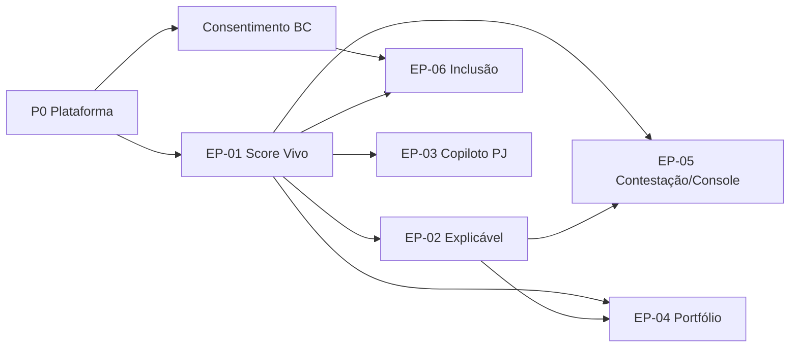

# Plano de Trabalho — Backend Prisma (Noah / Java ESP)

**Stack canônica:** Java 21 · Spring Boot 3 · Hexagonal + DDD · PostgreSQL 16 · Kafka · Redis · Flyway · OIDC (Keycloak)  
**Repo:** `Prisma/backend` · **Agente:** Noah (`dev-java-esp`)  
**Fontes:** Briefing · Arquitetura V2 · DBA V2 · 56 US-BE (EP-01…EP-06)

---

## 1. Inventário

| Épico | Nome | US-BE | Endpoints (aprox.) | Stack dominante | Release |
|-------|------|------:|-------------------:|-----------------|---------|
| **EP-01** | Score Vivo Event-Driven & PIT | 10 | 30 | Java · Kafka · Redis · Feast/ONNX · S3 WORM | R1 / Quick Win |
| **EP-02** | Motor Decisão Explicável | 10 | 29 | Java · política versionada · WORM · fairness | R1 |
| **EP-05** | Contestação + Console B2B | 9 | 26 | Java · PostgreSQL · Redis · OIDC | R1 (WSJF #1, depende 01/02) |
| **EP-06** | Score Inclusão + Coach B2C | 9 | 26 | Java · consentimento · thin-file | R1/R2 |
| **EP-03** | Copiloto GenAI PJ | 9 | 26 | **Python/FastAPI** + Java HITL · Bedrock · pgvector · Neptune | R2 |
| **EP-04** | Sala de Risco / Portfólio | 9 | 26 | Java · Neptune · Trino/Iceberg · Redis | R2 |

**Total:** 56 US-BE · ~163 endpoints · caminho quente DBA: `TITULAR → SCORE_MATERIALIZADO → DECISAO`

> **Nota Noah:** EP-03 núcleo GenAI = serviço Python. Este repo Java cobre HITL/alçada, identidade, decisão, eventos e APIs compartilhadas. Adapter Java ↔ Python via port out.

---

## 2. Prioridade (WSJF × dependência técnica)

Arquitetura V2: EP-05 lidera WSJF (6,12) mas **não nasce sem** EP-01 + EP-02.



| Ordem | Pacote | Objetivo |
|------:|--------|----------|
| **P0** | Scaffold + Flyway + OIDC stub + health | Hexagonal rodando |
| **P1** | EP-01 F01→F07→F06→F02→F09→F03→F04→F05 | Barramento + golden record + score + decisão p95&lt;250ms |
| **P2** | EP-02 F10→F04→F05→F01→F02→F03 | Política, trilha WORM, motivos, explicação |
| **P3** | EP-05 F05→F02→F01→F08→F06→F03→F07→F04 | Contestação + console (valor WSJF) |
| **P4** | EP-01 F08/F10 · EP-05 F09 · EP-02 F06–F09 | SLO, replay, fairness, simulação |
| **P5** | EP-06 | Consentimento → titularidade → ingest → thin-file → coach |
| **P6** | EP-03 / EP-04 | Release 2 (GenAI PJ + grafo/estresse) |

---

## 3. Sprints sugeridos (R1)

### Sprint 0 — Plataforma (3–5 dias)
- [x] Scaffold Maven Hexagonal (`br.com.ebv.prisma`)
- [x] `docker-compose` (Postgres 16 · Redis · Kafka)
- [x] Flyway `V1__baseline_platform` (titular / score / decisão)
- [ ] Health + OpenAPI + `.gitignore` Java
- [ ] Pacotes por bounded context: `identity`, `scoring`, `decision`, `dispute`, `consent`

### Sprint 1 — Identidade + Eventos (EP-01 F07, F01, F06)
| US | Entrega |
|----|---------|
| F07 | Golden record / merge |
| F01 | `POST /api/v1/events/credit` + Kafka ordenado |
| F06 | Ingest Open Finance / Cad. Positivo (adapters) |

### Sprint 2 — Feature Store + Score (EP-01 F02, F09, F03) — 🟡 ~70% (2026-07-28)
| US | Entrega | Status |
|----|---------|--------|
| F02 | Leitura PIT atributos | 🟡 ~75% API+Flyway V9+tests+smoke |
| F09 | Model registry promote/rollback | 🟡 ~70% API+Flyway V10+tests+smoke |
| F03 | Recálculo incremental por evento | 🟡 ~65% stub+coalescence+V11+smoke |

### Sprint 3 — Decisão + WORM (EP-01 F04, F05) — 🟡 ~70% (2026-07-28 local)
| US | Entrega | Status |
|----|---------|--------|
| F04 | Snapshot imutável `decision_id` | 🟡 ~70% V12 · WORM FS · GET/verify · PUT 405 |
| F05 | `POST /api/v1/decisions` p95 &lt; 250 ms | 🟡 ~70% budget · testes unit |

### Sprint 4 — Explicabilidade (EP-02 núcleo) — ✅ lab 10/10 (2026-07-28)
| US | Entrega | Status |
|----|---------|--------|
| F10 | Política versionada + publish/diff | 🟡 lab V15 · API · tests |
| F04 | Trilha WORM audit | 🟡 lab V17 · FS WORM · hook decisão |
| F05 | Catálogo + resolve motivos | 🟡 lab V16 · resolve stub |
| — | CORS Sofia FE (`prisma.cors.allowed-origins`) | ✅ |
| F01 | SHAP explain snapshot | 🟡 lab V18 · stub · 3 endpoints |
| F02 | Contrafactuais DiCE | 🟡 lab V19 · stub · simulate |
| F03 | Dossiê regulatório | 🟡 lab V20 · PDF stub · 201 |
| F06 | Revisão humana | 🟡 lab V21 · queue · decide 409 |
| F07 | Fairness metrics/alerts | 🟡 lab V22 · analyze 202 stub |
| F08 | Subject requests LGPD | 🟡 lab V23 · due_at por right_type |
| F09 | Policy simulate sandbox | 🟡 lab V24 · 202 · baseline |

F10 política → F04 trilha → F05 motivos → F01–F03 → **F06–F09 ✅ lab**

### Sprint 5 — Contestação + Console (EP-05 tronco) — ✅ lab 9/9 (2026-07-28)

| US | Entrega | Status |
|----|---------|--------|
| F05 | Autoatendimento identify/records/disputes | 🟡 lab session + lockout |
| F02 | Workflow open/queue/resolve | 🟡 lab V25 · SLA +7d · timeline |
| F01 | Tracking + timeline | 🟡 lab confirmDocumento last4 |
| F08 | Anexos + evidence-pack | 🟡 lab FS WORM · MIME allowlist |
| F06 | SLA escalate | 🟡 lab V26 · status/policies/escalations |
| F03 | Onboarding PME | 🟡 lab V27 · Serpro stub · complete→F07 |
| F07 | Credentials API | 🟡 lab V28 · create/rotate/revoke hash |
| F04 | Console billing | 🟡 lab V29 · usage/invoices/contracts |
| F09 | SAC analytics | 🟡 lab V30 · deflection/sac-cost/baseline |

F05 → F02 → F01 → F08 → F06 → F03 → F07 → F04 → F09 ✅ lab

### Sprint 6b — EP-06 Score Inclusão + Coach B2C — ✅ lab 9/9 (2026-07-28)

| US | Entrega | Status |
|----|---------|--------|
| F04 | Consentimento granular | 🟡 lab V31 · consents CRUD |
| F08 | Titularidade utilities | 🟡 lab V32 · link/links/unlink |
| F01 | Ingest alt data | 🟡 lab V33 · ingest/coverage/quality |
| F02 | Score thin-file | 🟡 lab V34 · score/model-card/{doc} |
| F03 | Coach journey | 🟡 lab V35 · journey/goals/progress |
| F05 | Gamificação | 🟡 lab V36 · missions/progress/achievements |
| F06 | Efeito estimado | 🟡 lab V37 · simulate/history |
| F07 | Marketplace | 🟡 lab V38 · offers/apply/eligibility |
| F09 | Monitoring/drift | 🟡 lab V39 · monitoring/drift/evaluate |

F04 → F08 → F01 → F02 → F03 → F05 → F06 → F07 → F09 ✅ lab · [`DEV_RECORD_EP06.md`](./DEV_RECORD_EP06.md)

### Sprint EP-04 — Sala de Risco / Portfólio — ✅ lab 9/9 (2026-07-28)

| US | Entrega | Status |
|----|---------|--------|
| F01 | Serviço grafo carteira | 🟡 lab V40 · graph/node/filter |
| F02 | Propagação / contágio | 🟡 lab V41 · simulate/critical |
| F03 | Motor estresse | 🟡 lab V42 · run/scenarios |
| F04 | Vigilância limites | 🟡 lab V43 · concentration/limits/alerts |
| F05 | Cubos incrementais | 🟡 lab V44 · aggregates/refresh/freshness |
| F06 | Comunidades | 🟡 lab V45 · detect/list/detail |
| F07 | Histórico / time-travel | 🟡 lab V46 · snapshot/compare/timeline |
| F08 | Dossiê executivo | 🟡 lab V47 · reports/download stub |
| F09 | Projeção 2D/tabular | 🟡 lab V48 · graph/2d · graph/tabular |

F01 → F09 ✅ lab · [`DEV_RECORD_EP04.md`](./DEV_RECORD_EP04.md) · **Neptune/Trino/Iceberg/Spark fora (stubs)**

### Sprint 6 — Hardening R1 (EP-03 GenAI **ADIADO**)
- [ ] OIDC smoke CTs (steward / SRE / B2B) com `OIDC_ENABLED=true`
- [ ] Testcontainers (Postgres/Kafka) smoke suite
- [ ] WORM port S3 (substituir FS lab onde crítico F04/F08)
- [ ] Documentar gap Neptune/ONNX/Fairlearn (sem GenAI EP-03)

> **EP-03 Copiloto PJ:** pulado — núcleo Python/Bedrock fora do escopo Noah neste ciclo.

---

## 4. Bounded contexts (Hexagonal)

```
src/main/java/br/com/ebv/prisma/
├── domain/          # puro — aggregates, VOs, ports
├── application/     # use cases @Transactional
├── infrastructure/  # JPA, Kafka, Redis, S3, Feast adapters
└── presentation/    # REST + DTO + @ControllerAdvice
```

| BC | Aggregates-chave (DBA) | Épicos |
|----|------------------------|--------|
| Identity | TITULAR | 01, 05, 06 |
| Scoring | SCORE_MATERIALIZADO, eventos crédito | 01, 06 |
| Decision | DECISAO, PROVA_DECISAO, POLITICA | 01, 02 |
| Dispute | CONTESTACAO, EVENTO_CONTESTACAO | 05 |
| Consent | ESCOPO_CONSENTIMENTO | 06 (+ ADR-006) |
| Portfolio | grafo / cubos | 04 |
| PjOpinion | parecer / alçada | 03 (Java HITL) |

**Proibições:** anemic domain · JPA no domain · lógica no controller · commit sem testes.

---

## 5. Gates de qualidade (por US)

1. Domain isolado + ports  
2. TDD red-green-refactor  
3. Coverage &gt; 80% (unit + integration)  
4. OpenAPI atualizado  
5. Flyway migration versionada  
6. Dev Agent Record na US  

Workflow agente: menu **DS** (8 fases).

---

## 6. O que falta do usuário / ambiente

| Item | Por quê | Doc |
|------|---------|------|
| **Redis · Kafka · Keycloak** | F01+JWT+cache | [`PROVISIONAMENTO_REDIS_KAFKA_KEYCLOAK.md`](./PROVISIONAMENTO_REDIS_KAFKA_KEYCLOAK.md) |
| Credenciais GitHub push | Publicar incremento | — |
| Decisão Open Finance (ADR até M2) | Adapter F06 | — |
| Escopo R1 (EP-06?) | Capacidade | — |
| Serviço Python EP-03 | Monorepo vs repo | — |

---

## 7. Próximo comando Noah

- F07 núcleo ok · F01 em stub local (sem Kafka) — ver progress report  
- Ao provisionar infra: preencher `.env` + `SPRING_PROFILES_ACTIVE=supabase,infra`  
- Spec: [`PROVISIONAMENTO_REDIS_KAFKA_KEYCLOAK.md`](./PROVISIONAMENTO_REDIS_KAFKA_KEYCLOAK.md)
