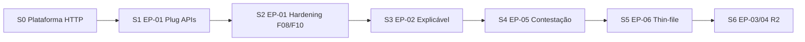

# Plano de Trabalho — Frontend Prisma (Sofia / React ESP)

| Campo | Valor |
|-------|-------|
| **Agente** | Sofia · `dev-reactjs-esp` |
| **Produto** | EBV Prisma · Equifax / BoaVista |
| **Repo FE** | `Prisma/frontend` (origem: [PrismaShowcase](https://github.com/SolutionCenter4Sys/PrismaShowcase)) |
| **Repo BE** | `Prisma/backend` (Noah · Java ESP) |
| **Monorepo Git** | [ebv-ai-dlc](https://github.com/samuelpimentel4sys/ebv-ai-dlc) |
| **Atualizado em** | 2026-07-28 |
| **Missão** | Pluguar showcase (56 telas mock) → APIs reais do backend |
| **Stack** | **Congelada** = showcase (Vite · React 18 · RR7 · Tailwind · Equifax DS) — sem migração Next/MUI |
| **Design System** | Equifax DS v1.0 — [`Equifax_Design_System_v1.0.html`](./Equifax_Design_System_v1.0.html) · tokens em `src/styles/eqx-tokens.css` |

---

## 1. Contexto recebido (briefing de missão)

| # | Fonte | Uso |
|---|-------|-----|
| 1 | Clone `PrismaShowcase` | Base UI já com 56 US-FE |
| 2 | `AI-DLC/Prisma/frontend` | Espaço de trabalho FE (commits/push no monorepo) |
| 3 | `00_Briefing_Negocio_EBV_Prisma.html` | Problemas estruturais EBV + valor Prisma |
| 4 | `03.ARQUITETURA_V2.html` | Bounded contexts, releases, dependências |
| 5 | `12_DBA_V2.html` | Caminho quente `TITULAR → SCORE → DECISAO` |
| 6 | `User Stories/Frontend` | Contratos tela ↔ endpoint (seção 8.1) |
| 7 | `User Stories/Backend` + OpenAPI Noah | Contrato canônico BE |
| 8 | `Equifax_Design_System_v1.0.html` | Tokens 3 tiers · WCAG 2.2 AA · budgets · estados de dados |

### Design System Equifax v1.0 (obrigatório)

| Item | Regra |
|------|-------|
| Tokens | Tier1 `--eqx-*` → Tier2 `--color-*` / `--space-*` → Tier3 componentes |
| Consumo | `rgb(var(--color-*))` — **nunca HEX hardcoded** no JSX |
| Tipografia | Open Sans (+ Arial/Helvetica fallback) |
| Touch | ≥ 48×48 (`--size-target: 3rem`) |
| A11y | WCAG **2.2** AA · teclado · foco visível |
| Data display (§21) | `loading` · `empty` · `no-results` · `partial` · `error` |
| Tema | `data-theme=light\|dark` + density modes |
| Brand | Vermelho Equifax (`--color-brand`) · action azul · accent laranja |
| Código FE | Já alinhado: `eqx-tokens.css` espelha o HTML do DS |

**OpenAPI / Swagger (Noah):**

| Recurso | URL |
|---------|-----|
| Swagger UI | http://localhost:8080/swagger-ui.html |
| OpenAPI JSON | http://localhost:8080/api-docs |
| Health | http://localhost:8080/actuator/health |

---

## 2. Diagnóstico do showcase clonado

### Stack real (fonte de verdade do código — prevalece sobre specs Next.js/MUI das US)

| Camada | Showcase | Nota Sofia |
|--------|----------|------------|
| Build | **Vite 6** | Não Next.js |
| UI | React 18 + TypeScript strict | OK |
| Rotas | React Router 7 | Rotas = paths das US-FE |
| Estilo | Tailwind 3 + **Equifax DS** (`eqx-tokens.css`) | Não Material-UI |
| Dados | `data.ts` + **`useMockQuery`** | Zero HTTP hoje |
| Testes | Vitest + Testing Library + axe-core | Manter |

### Estrutura

```
src/
  styles/eqx-tokens.css
  ds/          # primitivas Equifax DS
  shell/       # AppShell, Sidebar, TopBar…
  app/         # rotas, trilhas, home
  epics/
    score-vivo/        # EP-01 · 10 telas
    explicabilidade/   # EP-02 · 10 telas
    copiloto-pj/       # EP-03 · 9 telas
    sala-risco/        # EP-04 · 9 telas
    contestacao/       # EP-05 · 9 telas
    thinfile/          # EP-06 · 9 telas
  lib/useMockQuery.ts  # máquina idle|loading|success|empty|partial|error
```

**Ponto de corte da integração:** substituir loaders mock por client HTTP **sem quebrar** a máquina de estados do DS (seção 21) nem `?state=error|empty|partial`.

---

## 3. Estado do Backend (Noah · 2026-07-28)

Fonte: `backend/docs/RELATORIO_PROGRESSO_BACKEND.md`

| Escopo | Status |
|--------|--------|
| Épicos BE | Só **EP-01** em andamento |
| Features EP-01 | 8/10 tocadas · 0/10 DoD 100% |
| EP-02…06 | Não iniciados |
| OpenAPI | Springdoc em `/api-docs` |

### Controllers REST já existentes (código)

| Controller | Prefixo | Features |
|------------|---------|----------|
| `CreditEventController` | `/api/v1/events/*`, `/streams/health` | F01 |
| `FeatureController` | `/api/v1/features` | F02 |
| `ScoreController` | `/api/v1/score` | F03 |
| `DecisionController` | `/api/v1/decisions` | F04 · F05 |
| `IngestController` | `/api/v1/ingest` | F06 |
| `IdentityController` | `/api/v1/identity` | F07 |
| `ModelController` | `/api/v1/models` | F09 |
| `PlatformController` | `/api/v1/platform/info` | transversal |

**Ainda sem controller BE:** F08 SLO · F10 Replay · todo EP-02…EP-06.

Detalhe FE↔BE: ver [`MAPA_FE_VS_BE.md`](./MAPA_FE_VS_BE.md).

---

## 4. Estratégia de integração (non-negotiable)

```
Tela (Presentation)
  → hook useXxxQuery / useXxxMutation
    → api/<bc>Client.ts  (fetch via httpClient)
      → DTO alinhado OpenAPI / US §8.1
        → map DTO → view-model da tela (se necessário)
```

| Regra | Detalhe |
|-------|---------|
| **Feature flag** | `VITE_DATA_MODE=mock \| live` — demo continua possível |
| **httpClient** | Único ponto HTTP; header `X-Correlation-ID` (já no shape de erro do mock) |
| **Proxy Vite** | `/api` → `http://localhost:8080` em dev |
| **Auth** | Bearer OIDC Keycloak (alinhado Noah); stub/dev-bypass combinado com BE |
| **Contrato** | Diff DTO mock (`data.ts`) × OpenAPI; gap = issue FE ou ticket Noah |
| **Estados UI** | Manter `QueryStatus` do `useMockQuery`; live = `useApiQuery` com mesma interface |
| **Equifax DS** | Tokens `--color-*` / `--space-*`; zero HEX hardcoded |
| **Não reescrever telas** | Plug na borda de dados; UI só muda se contrato exigir |

---

## 5. Sprints FE (espelho Noah + WSJF)



### Sprint 0 — Plataforma HTTP (1–2 dias) · **PRÓXIMO**

- [ ] `.env.example` · `VITE_API_BASE_URL` · `VITE_DATA_MODE`
- [ ] `src/lib/httpClient.ts` (correlation-id, JSON, erros → `ApiErrorShape`)
- [ ] `src/lib/useApiQuery.ts` (mesma máquina de estados do mock)
- [ ] Proxy em `vite.config.ts`
- [ ] Smoke: `GET /actuator/health` + `GET /api/v1/platform/info`
- [ ] Doc: como alternar mock/live

### Sprint 1 — EP-01 plug (APIs já no BE)

Ordem alinhada FE índice + readiness Noah:

| Ordem | US-FE | Tela / rota | BE status | Ação |
|------:|-------|-------------|-----------|------|
| 1 | F07 | `/dados/identidade/mesclagem` | 🟡 ~85% | live |
| 2 | F01 | `/plataforma/eventos/saude` | 🟡 ~75% | live |
| 3 | F06 | `/dados/ingestao/conectores` | 🟡 ~70% | live |
| 4 | F02 | `/risco/features/catalogo` | 🟡 ~80% | live |
| 5 | F09 | `/ml/models/registry` | 🟡 ~75% | live |
| 6 | F03 | `/risco/score/:doc/historico` | 🟡 ~70% | live |
| 7 | F04 | `/compliance/decisoes/comparar` | 🟡 ~70% | live |
| 8 | F05 | `/integracao/playground/decisoes` | 🟡 ~70% | live |

Por tela: client + map + troca loader + teste de contrato + smoke manual Swagger.

### Sprint 2 — EP-01 restante (aguarda Noah)

| US-FE | Rota | Gate |
|-------|------|------|
| F08 | `/plataforma/observabilidade/slo` | BE F08 |
| F10 | `/dados/replay/jobs` | BE F10 |

Até lá: mock permanece; badge “mock” no shell quando `VITE_DATA_MODE=mock` ou endpoint 404.

### Sprint 3 — EP-02 Explicabilidade

Depende Sprint 4 Noah (política → trilha → motivos → SHAP…).  
Telas em `epics/explicabilidade/`. Prioridade FE: F01 fatores → F02 contrafactuais → F04 trilha → F05 motivos → F03 dossiê → F06 revisão.

### Sprint 4 — EP-05 Contestação / Console B2B

WSJF #1 no negócio, mas **depende EP-01+02**. Telas já em `epics/contestacao/` (mock).  
Nota: **índice US-FE EP-05 ausente** na pasta Downstream Frontend — validar com Escritor Front; telas showcase existem.

### Sprint 5 — EP-06 Thin-file / Coach

`epics/thinfile/` · após consentimento + score inclusão no BE.

### Sprint 6 — EP-03 Copiloto PJ · EP-04 Sala de Risco (Release 2)

`copiloto-pj/` · `sala-risco/` · GenAI Python + Neptune — FE só após contratos BE estáveis.

---

## 6. Inventário épicos FE

| Épico | Pasta showcase | US-FE | Bindings BE (índice) | Release | Plug agora? |
|-------|----------------|------:|---------------------:|---------|-------------|
| EP-01 Score Vivo | `score-vivo` | 10 | 30 | R1 | **Sim** (8/10) |
| EP-02 Explicável | `explicabilidade` | 10 | ~30 | R1 | Não (BE 0%) |
| EP-03 Copiloto PJ | `copiloto-pj` | 9 | ~27 | R2 | Não |
| EP-04 Sala Risco | `sala-risco` | 9 | ~26 | R2 | Não |
| EP-05 Contestação | `contestacao` | 9* | ~26 | R1 | Não (dep.) |
| EP-06 Thin-file | `thinfile` | 9 | ~26 | R1/R2 | Não |

\* Telas no repo; índice MD EP-05 FE não encontrado no Downstream.

**Total:** 56 telas · ~163 bindings planejados · plug imediato ≈ **24 endpoints EP-01**.

---

## 7. Gates de qualidade (por US-FE)

1. Tela renderiza em `live` com BE up  
2. Estados `loading / empty / error` cobertos (URL `?state=` ou falha real)  
3. DTO tipado; zero `any` / `as` injustificado  
4. Teste Vitest do client (mock fetch) + smoke página  
5. axe-core sem regressão na rota  
6. Dev Agent Record na US (ou `docs/DEV_RECORD_Fxx.md`)  
7. Commit atômico por feature (mensagem convencional)

---

## 8. Dependências externas / alinhamento Noah

| Item | Por quê | Owner |
|------|---------|-------|
| BE up + profiles `supabase,infra` | Live mode | Noah / ops |
| Keycloak clients FE | Login real | Provisionamento Redis/Kafka/Keycloak |
| Diff OpenAPI × `data.ts` | Evitar bug de contrato | Sofia + Noah |
| Índice US-FE EP-05 | Rastreabilidade | Escritor Front |
| Política CORS / proxy | Dev local | Sofia (Vite) + Noah (SecurityConfig) |

---

## 9. Próximos comandos Sofia (após aprovação deste plano)

1. Sprint 0: `httpClient` + `useApiQuery` + `.env.example` + proxy  
2. `npm install` · `npm run dev` · validar 56 rotas ainda em mock  
3. Sprint 1.1: plug **F07 Identity** (maior maturidade BE)  
4. Sync diário com relatório Noah — só avançar feature com controller + OpenAPI

---

## 10. Fontes

- Briefing / Arquitetura V2 / DBA V2 — `99.DownStream/Resumo do UpStream/`
- US-FE / US-BE — `…/User Stories/{Frontend,Backend}/`
- Noah — `Prisma/backend/docs/PLANO_TRABALHO_BACKEND.md` · `RELATORIO_PROGRESSO_BACKEND.md`
- Showcase — `Prisma/frontend/README.md`

---

_Gerado por Sofia · ReactJS Expert · missão plug FE↔BE Prisma_
